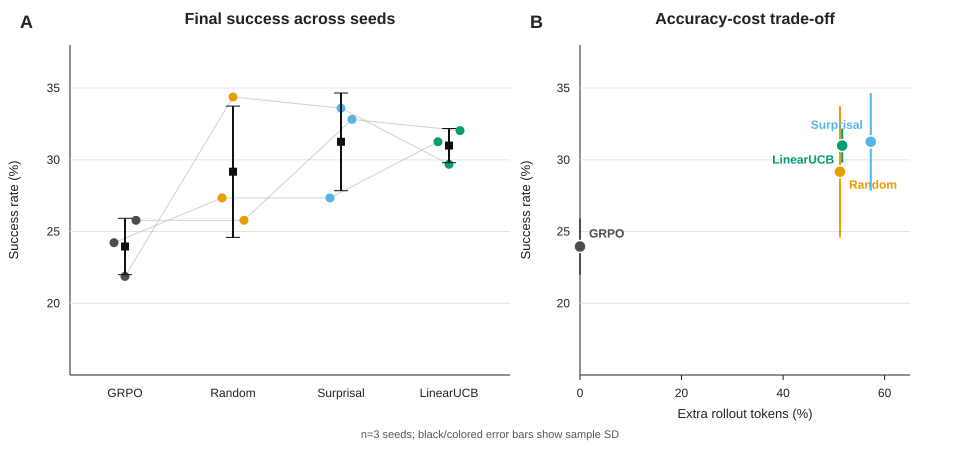

# ProbeGRPO

ProbeGRPO is an internship-oriented Agent-RL project that demonstrates a complete path from
multi-turn environment rollouts to fine-grained policy updates. It adds **budget-aware,
counterfactual turn probing** to GRPO: the system replays selected decision points, tries a different
valid action, measures the change in environment reward, and applies the resulting credit only to
the corresponding assistant turn.

The goal is a credible, inspectable engineering project—not a claim that counterfactual credit
assignment itself is new. The differentiators are a small reusable core, deterministic replay checks,
matched-budget schedulers, current verl integration, RAGEN-derived task adapters, and explicit cost
accounting.

## 保存与复现入口（2026-10-02）

代码、配置和小结果保存在 Git；框架用固定 commit + 最小 patch；模型、数据和原始输出
放在独立归档，并记录 SHA-256。[保存清单](repro/ARTIFACTS.md) ·
[从干净环境开始](REPRODUCE.md) · [仓库盘点](REPO_AUDIT.md) ·
[核验记录](repro/validation/README.md)。

12 次历史运行的 1,536 条最终评估记录已重新核对。主实验当时没有保存最终模型权重；
现存大 checkpoint 属于早期 GSM8K smoke。新的 GPU 训练尚未重跑。

## What is implemented

- A framework-independent `ReplayableEnv` contract with deterministic prefix replay and state hashes.
- Structured `TurnRecord`, `Anchor`, `ProbeResult`, and experiment metrics types.
- Random, chosen-token-surprisal, and online LinearUCB anchor schedulers.
- Paired factual/counterfactual suffix probing with strict replay validation.
- Probe-aware GRPO advantage shaping with exact assistant-turn token masks.
- A lazy torch/verl adapter that keeps the core package dependency-free.
- A deterministic Sokoban environment, public RAGEN data adapter, and one-command CPU smoke test.
- A pinned current-verl bootstrap and five-update `Qwen/Qwen3.5-2B` GRPO gate for one 48 GB GPU.

The operator has run five standard GRPO updates, restored step 5 into step 6, and verified a
corrected one-update run with 8 trajectories and nonzero gradients. See the
[GPU gate evidence](experiments/environment/2026-09-19-gpu-gate.md) for the differing configs,
failures and evidence limits. This is not a ProbeGRPO performance result.

A current-verl Sokoban AgentLoop has completed real Qwen rollouts and actor updates with and
without probe credit. The three handcrafted levels remain smoke fixtures only. Formal experiments
use an immutable public RAGEN release, deduplicate board layouts, remove train/test overlap, and
record an exact shortest-path oracle for every selected board. Follow
[the AgentLoop runbook](docs/SOKOBAN_AGENTLOOP.md).

## Main result

The frozen public-Sokoban comparison completed 50 training updates for four methods and three
seeds on `Qwen/Qwen3.5-2B`. Values are mean +/- sample standard deviation across seeds 17, 42, and
101 on the same 128 held-out boards.

| Method | Final success | Paired uplift vs GRPO | Extra rollout tokens |
|---|---:|---:|---:|
| GRPO | 24.0% +/- 2.0% | - | 0.0% |
| Random-B2 | 29.2% +/- 4.6% | +5.2 +/- 6.5 pp | 51.2% |
| Surprisal-B2 | 31.2% +/- 3.4% | +7.3 +/- 4.3 pp | 57.3% |
| **LinearUCB-B2** | **31.0% +/- 1.2%** | **+7.0 +/- 0.8 pp** | **51.6%** |



LinearUCB improves over its matched GRPO run on all three seeds and has the lowest cross-seed
variance among probe methods. Surprisal has a 0.2-point higher mean, too small relative to the
observed seed variation to treat as a meaningful win, at greater rollout cost. Random finds more
high-impact anchors per 1,000 probe tokens, so this
result supports counterfactual turn credit and LinearUCB stability—not a claim that LinearUCB is
the best anchor-efficiency scheduler. See the [full result record](experiments/results/public_sokoban_main_v1/README.md),
including protocol deviations and evidence limits.

## Architecture

```text
main K=4 rollouts
       |
       v
 TurnRecord extraction -----> anchor scheduler
                                  |  budget B=2
                                  v
                           deterministic replay
                              /            \
                       factual suffix   counterfactual suffix
                              \            /
                               delta reward
                                    |
                                    v
trajectory GRPO advantage + turn-local probe credit
                                    |
                                    v
                              policy update
```

See [docs/ARCHITECTURE.md](docs/ARCHITECTURE.md) for the data contract and integration boundary.

## Quick start (CPU, no model download)

The core and smoke test intentionally require only the Python standard library.

```bash
cd ProbeGRPO
python3 -m venv .venv
source .venv/bin/activate
python -m pip install --upgrade pip
python -m pip install -e .
make check
```

See [REPRODUCE.md](REPRODUCE.md) for clean-clone steps, the pinned `verl` patch, data/model
provenance, and the GPU smoke/run requirements.

If the environment already exists, only activate it and run `make check`. This local macOS
environment is for development and CPU tests; create a separate environment on the NVIDIA Linux
host for verl, PyTorch CUDA, and vLLM.

## CPU smoke validation

For a standalone CPU data-flow smoke without installation:

```bash
bash scripts/run_cpu_smoke.sh
```

Expected final line:

```text
ProbeGRPO CPU data-flow smoke test passed
```

## Current verl + Qwen3.5

The default model is [`Qwen/Qwen3.5-2B`](https://huggingface.co/Qwen/Qwen3.5-2B). RAGEN's released
training dependencies are too old for this model, so ProbeGRPO pins a current verl revision and its
frozen dependency lock plus an explicit NumPy 2.3.5 compatibility override. On an AutoDL Linux
instance with one 48 GB NVIDIA GPU:

```bash
bash scripts/check_gpu_host.sh /path/to/persistent-workspace
bash scripts/bootstrap_verl.sh /path/to/persistent-workspace/probegrpo-runtime
export MODEL_PATH=/path/to/persistent-workspace/models/Qwen3.5-2B-15852e8
/path/to/persistent-workspace/probegrpo-runtime/verl/.venv/bin/python scripts/download_model.py --output-dir "$MODEL_PATH"
bash scripts/check_verl_stack.sh /path/to/persistent-workspace/probegrpo-runtime/verl
bash scripts/run_verl_grpo_smoke.sh /path/to/persistent-workspace/probegrpo-runtime/verl
```

The first paid run deliberately uses GSM8K rather than an agent environment. It verifies model
loading, vLLM generation, LoRA/FSDP2 updates, grouped GRPO, checkpointing, and resume before we add
Sokoban complexity. See [docs/GPU_RUNBOOK.md](docs/GPU_RUNBOOK.md).

The ProbeGRPO integration adapter expects the trainer batch to contain:

- `advantages`: `[batch, tokens]`
- `probe_turn_masks`: `[batch, anchors, tokens]`
- `probe_deltas`: `[batch, anchors]`
- `probe_valid`: `[batch, anchors]`

It divides valid deltas by `max(1, largest absolute valid delta)` in the batch and adds
`lambda * normalized_delta * turn_mask` to the base advantages. A zero factual-minus-
counterfactual reward difference always adds zero credit.

## Project milestones

1. **Core correctness:** `make check` passes; deterministic replay and masked advantages are tested.
2. **GPU stack gate:** Qwen3.5-2B completes five standard GRPO updates and resumes on current verl.
3. **Agent rollout:** a RAGEN-derived Sokoban task completes multi-turn current-verl `AgentLoop`
   rollouts and deterministic prefix replay.
4. **Matched-budget comparison:** completed GRPO, random, surprisal, and LinearUCB on three seeds.
5. **Portfolio packaging:** result table and cost figure are complete; trajectory demo and optional
   WebShop extension remain.

For an internship portfolio, a well-explained negative result is acceptable. Do not fabricate gains;
report when extra probes improve credit diagnostics but fail to improve final reward.

The reproducible ablation is launched on one GPU with:

```bash
bash scripts/run_sokoban_ablation.sh /root/autodl-tmp/probegrpo-runtime/verl main
```

Set `SEED` to 17, 42, or 101. The runner writes JSON and Markdown per-seed tables. Run
`make results` to reproduce the committed three-seed aggregation and SVG. The current budget
implementation probes the first `B` of four sampled episodes in each prompt group and selects one
turn inside each episode; it is not yet a group-wide top-B selector.

## Evaluation metrics

- task reward and success rate;
- invalid-action rate and mean episode length;
- reward/advantage variance;
- total rollout tokens, GPU hours, and wall-clock time;
- high-impact anchors found per 1,000 extra rollout tokens;
- Sokoban rank correlation against an exhaustive counterfactual oracle.

## Repository policy

- Raw traces, checkpoints, and W&B files belong under ignored `artifacts/`, `outputs/`, or `wandb/`.
- Keep full resumable checkpoints outside Git; publish a portable adapter only after an actual export and verification. No main-run adapter currently exists.
- Never commit API keys, cookies, WebShop sessions, or unredacted external traces.
- Results must include the exact config, git revision, seeds, and unsuccessful runs.
- The upstream `verl` source is fetched at a pinned commit during environment setup; its source tree
  is not vendored in this repository. ProbeGRPO's local trainer change is maintained as
  `patches/verl-probegrpo.patch` and applied by `scripts/bootstrap_verl.sh`.

## Resume bullet

> Built ProbeGRPO, a Qwen3.5 Agent-RL system on current verl with deterministic counterfactual
> replay, budget-aware anchor scheduling, and turn-local advantage shaping; improved public
> Sokoban success from 24.0% +/- 2.0% to 31.0% +/- 1.2% across three seeds while measuring a
> 1.516x rollout-token cost.
