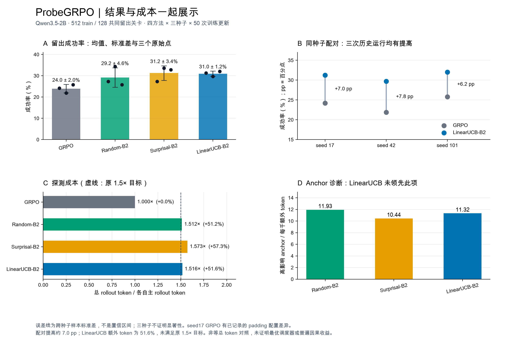
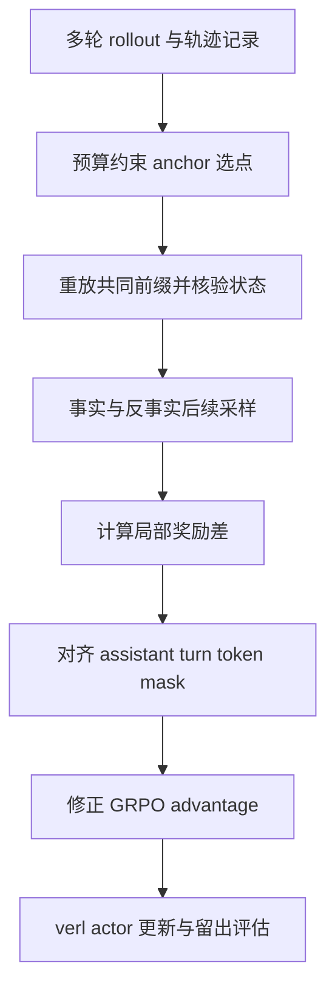

# ProbeGRPO

**多轮 Agent 的预算约束反事实探测与局部信用分配。**

ProbeGRPO 在 GRPO 训练链路中重放选中的决策状态，对比原动作与替代动作的后续奖励，将局部奖励差用于对应 assistant turn 的策略更新。项目包含确定性环境回放、探测调度、token mask、verl 接入，以及公开 Sokoban 的多种子训练与成本分析。

| 阅读目的 | 入口 |
|---|---|
| 快速了解问题与方法 | [项目导览](docs/PROJECT_WALKTHROUGH.md) |
| 查看结果图与逐种子数据 | [结果分析](docs/results/README.md) |
| 查看回放、选点与训练接入 | [系统架构](docs/ARCHITECTURE.md) |
| 运行演示或准备 GPU 实验 | [快速开始](#快速开始) · [完整复现说明](REPRODUCE.md) |

## 实验结果

模型为 `Qwen/Qwen3.5-2B`；512 个训练关卡、128 个共同留出关卡。四种方法各运行三个种子（17、42、101）、每次 50 次训练更新。下表为跨种子均值 ± 样本标准差；百分点简称 pp。

| 方法 | 留出成功率 | 相对 GRPO 的配对差值 | 额外 rollout token |
|---|---:|---:|---:|
| GRPO | 24.0% ± 2.0 pp | — | 0.0% |
| Random-B2 | 29.2% ± 4.6 pp | +5.2 ± 6.5 pp | 51.2% |
| Surprisal-B2 | 31.2% ± 3.4 pp | +7.3 ± 4.3 pp | 57.3% |
| LinearUCB-B2 | 31.0% ± 1.2 pp | +7.0 ± 0.8 pp | 51.6% |



三次历史运行中，LinearUCB-B2 均高于对应 GRPO；Surprisal 的成功率均值更高，Random 的每千额外 token 高影响 anchor 诊断更高。结果尚未证明某个调度器全面最优。

**结果范围：**seed17 GRPO 存在历史 padding 配置差异；比较没有匹配总 token 预算。额外 token 比例以各方法自身的主 rollout token 为分母。误差线是样本标准差，不是置信区间；12 次运行评估的是同一批 128 个关卡。主实验最终权重未保存，轨迹与评估记录已有归档。

[完整分析](docs/results/README.md) · [实验协议](experiments/results/public_sokoban_main_v1/README.md) · [归档核验](repro/validation/README.md)

## 方法与训练链路


```mermaid
flowchart TD
    A[多轮 rollout 与轨迹记录] --> B[预算约束 anchor 选点]
    B --> C[重放共同前缀并核验状态]
    C --> D[事实与反事实后续采样]
    D --> E[计算局部奖励差]
    E --> F[对齐 assistant turn token mask]
    F --> G[修正 GRPO advantage]
    G --> H[verl actor 更新与留出评估]
```

- **回放与探测：**`ReplayableEnv`、状态哈希和成对后续采样；回放不一致时跳过探测。
- **调度：**Random、chosen-token Surprisal、LinearUCB；记录探测信号与额外开销。
- **训练接入：**修正所选 assistant turn 的 advantage，零差值保持零，零预算退化为普通 GRPO。
- **环境与执行：**公开 RAGEN 数据适配、Sokoban AgentLoop、LoRA／FSDP2／vLLM 链路。

当前 B=2 实现先选择两条 episode，再分别选择 turn；尚未实现组内所有候选的全局 top-B。局部奖励差也不等于完整因果贡献。

## 快速开始

CPU 演示需要 Python 3.9+，核心包依赖标准库，无需 GPU、模型下载或 API Key。在仓库根目录执行：

```bash
bash scripts/run_cpu_smoke.sh
```

脚本验证核心探测与 advantage 数据流，以及微型 Agent 环境交互。核心 smoke 的成功标志为 `ProbeGRPO CPU data-flow smoke test passed`；这些演示不是正式训练成绩。

需要安装包时：

```bash
python3 -m venv .venv
source .venv/bin/activate
python -m pip install -e .
make check
```

GPU 训练使用独立 NVIDIA Linux 环境。按[完整复现说明](REPRODUCE.md)、[GPU 手册](docs/GPU_RUNBOOK.md)及 [AgentLoop 手册](docs/SOKOBAN_AGENTLOOP.md)准备固定框架、数据和模型；CPU 演示不会触发这些步骤。

## 代码与证据

| 模块 | 位置 |
|---|---|
| 类型、回放与状态校验 | [types.py](src/probegrpo/types.py) · [replay.py](src/probegrpo/replay.py) |
| 探测与选点 | [probing.py](src/probegrpo/probing.py) · [episode_probing.py](src/probegrpo/episode_probing.py) · [schedulers.py](src/probegrpo/schedulers.py) |
| 局部 credit 与批次对齐 | [advantage.py](src/probegrpo/advantage.py) · [verl sidecar](src/probegrpo/integration/verl_v1_sidecar.py) |
| 多轮环境接入 | [Sokoban AgentLoop](src/probegrpo/integration/sokoban_agent_loop.py) |
| 正式实验与数据 | [公开 Sokoban 结果](experiments/results/public_sokoban_main_v1/) |
| 故障、约束与负结果 | [问题复盘](docs/incidents/README.md) |
| 固定版本与外部归档 | [保存清单](repro/ARTIFACTS.md) · [仓库盘点](REPO_AUDIT.md) |

项目实现与记录用于研究和复现，不声称反事实信用分配本身是原创方法。相关运行与评测项目为 [SWE-HarnessLab](https://github.com/brwjf4y9hz-collab/SWE-HarnessLab)；两个项目各自报告任务与成绩。
